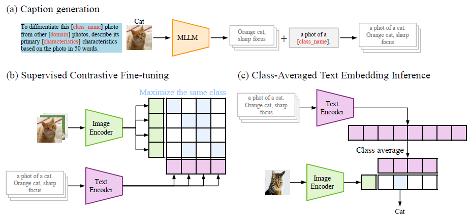

# MultiModal Fine-tuning with Synthetic Captions
This is a pytorch implementation of the following paper [[arXiv]](https://arxiv.org/abs/2601.21426):  


Please read license.txt before reading or using the files.  

# Running Experiments

## Workflow

### 1. Generate captions
Generate synthetic captions for the dataset using an MLLM.
```bash
python generate_captions.py --dataset Pet --prompt_type VisualCaption
python generate_captions.py --dataset Pet --prompt_type ShapeCaption
python generate_captions.py --dataset Pet --prompt_type TextureCaption
```

### 2. Merge captions
Combine multiple caption files into a single JSON file.
```bash
python merge_captions.py \
  -i captions/gemini-2.5-flash-lite/Pet/VisualCaption.json \
     captions/gemini-2.5-flash-lite/Pet/ShapeCaption.json \
     captions/gemini-2.5-flash-lite/Pet/TextureCaption.json \
  -o captions/gemini-2.5-flash-lite/Pet/VisualShapeTextureCaption.json
```

### 3. Fine-tune
Fine-tune the model using the generated captions.
```bash
python main.py \
  --dataset Pet \
  --model_name RN50 \
  --captions captions/gemini-2.5-flash-lite/Pet/VisualShapeTextureCaption.json \
  --add_class_template \
  --w 0.1
```

### 4. Aggregate results
Collect and summarize experimental results.
```bash
python collect_results.py --dir output/
```

# Citation

```
@misc{enomoto2026mmft,
      title={MultiModal Fine-tuning with Synthetic Captions}, 
      author={Shohei Enomoto and Shin'ya Yamaguchi},
      year={2026},
      eprint={2601.21426},
      archivePrefix={arXiv},
      primaryClass={cs.CV},
      url={https://arxiv.org/abs/2601.21426}, 
}

```
